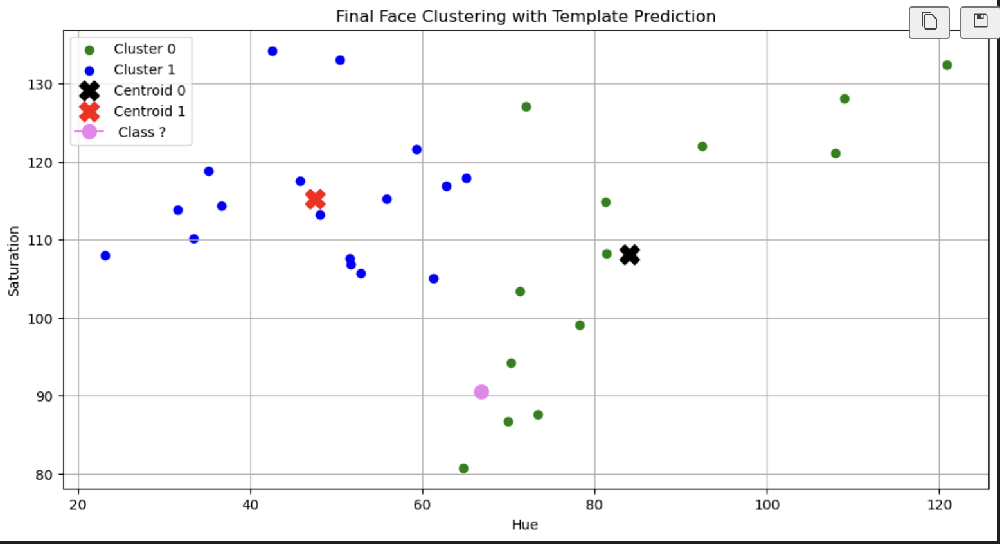

# Face Clustering and Template Classification using K-Means

## 🛠 Methodology

### 1️⃣ Face Detection
- Used OpenCV's Haar Cascade classifier.
- Converted images to grayscale.
- Applied `detectMultiScale()` to locate faces.

### 2️⃣ Feature Extraction
- Converted detected face regions from BGR to HSV color space.
- Extracted:
  - Mean Hue
  - Mean Saturation
- Created a 2D feature vector for each face.

### 3️⃣ Clustering
- Applied K-Means clustering (`n_clusters = 2`).
- Trained model on extracted Hue-Saturation features.
- Obtained cluster centroids.

### 4️⃣ Template Classification
- Detected face in template image.
- Extracted HSV features.
- Used `kmeans.predict()` to determine cluster membership.

---

## 📊 Visualisations

### 🔹 Face Detection Output

---

### 🔹 Hue-Saturation Feature Clustering

- Green → Cluster 0  
- Blue → Cluster 1  
- X → Centroids  

## ✅ Conclusion

This project demonstrates a complete machine learning workflow:
- Face detection
- Feature extraction
- Unsupervised learning (K-Means)
- Prediction and visualization

Although the model clusters faces based on color similarity, it highlights the importance of feature selection in classification tasks.

